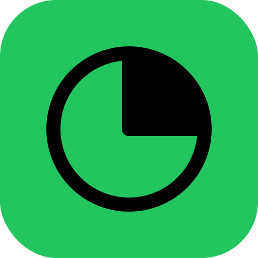
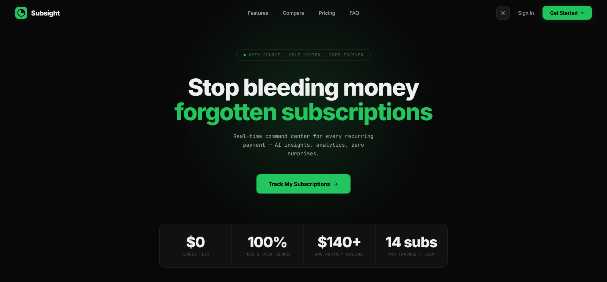

<div align="center">

  

# Subsight

**The open-source subscription tracker that gives you full control over your recurring spending**

[](https://subsight-tracker.vercel.app)
[](LICENSE)
[](https://typescriptlang.org)
[](https://reactjs.org)
[](https://nextjs.org)
[](https://supabase.com)
[](https://tailwindcss.com)
[](https://console.groq.com)

</div>

---

<div align="center">
  
</div>

---

## Overview

Most people have no idea how much they're spending on subscriptions every month. Subsight fixes that — it's a self-hosted, open-source subscription tracker with an AI-powered dashboard that gives you real-time visibility into every recurring charge. Unlike Truebill or Rocket Money, you own your data, it's free forever, and you can self-host it in minutes.

---

## ✨ Features

- 🚀 **Real-time Dashboard** — KPI metrics, monthly spend, active subscriptions, and upcoming renewals at a glance
- 🧠 **AI Auto-Fill** — Type a service name and Groq AI fills in the provider, category, price, and billing cycle automatically
- 🎭 **Simulation Mode** — Toggle subscriptions on/off to preview how cancellations affect your monthly budget before committing
- 📊 **Advanced Analytics** — Monthly spending bar charts, category donut breakdown, and annual totals with trend indicators
- 📤 **Multi-Format Export** — Export your full subscription list to JSON, CSV, or a formatted PDF report
- 🔔 **Renewal Alerts** — Email reminders sent 1, 3, 7, or 14 days before a subscription renews via SMTP
- 🎯 **Spending Goals** — Set monthly or annual budget targets per category and track progress
- 🏷️ **Custom Categories** — Create your own categories with custom colors and icons beyond the built-in set
- 🔍 **Duplicate Detection** — Smart Levenshtein-based detection warns you before adding a subscription you already track
- 💱 **Multi-Currency Support** — Track subscriptions in USD, EUR, GBP, JPY, CAD, and AUD with automatic conversion
- 🔒 **Supabase Auth + RLS** — Secure authentication with Google OAuth and row-level security so your data stays yours
- 🌗 **Dark & Light Theme** — Fully themed UI that persists across sessions

---

## 🛠 Tech Stack

| Category   | Technology                             |
| ---------- | -------------------------------------- |
| Framework  | Next.js 15 (App Router + Turbopack)    |
| Language   | TypeScript 5                           |
| Styling    | Tailwind CSS v3 + shadcn/ui (Radix UI) |
| Backend    | Supabase (Auth + PostgreSQL + RLS)     |
| AI         | Groq AI (fast + quality models)        |
| Charts     | Recharts                               |
| Forms      | React Hook Form + Zod                  |
| PDF Export | jsPDF + html2canvas                    |
| Email      | Nodemailer (SMTP)                      |
| Payments   | Stripe (Pro plan billing)              |
| Testing    | Vitest + Playwright                    |
| Deployment | Vercel                                 |

---

---

## 🚀 Quick Start

### Prerequisites

- Node.js 18+
- pnpm (`npm install -g pnpm`)
- Supabase account — [supabase.com](https://supabase.com)
- Groq API key — [console.groq.com](https://console.groq.com) (free, for AI features)

### Installation

```bash
# 1. Clone the repo
git clone https://github.com/MuhammadTanveerAbbas/Subsight-Tracker.git
cd Subsight-Tracker

# 2. Install dependencies
pnpm install

# 3. Set up environment variables
cp .env.example .env.local
# Fill in your values (see Environment Variables section below)

# 4. Run the development server
pnpm dev

# 5. Open in browser
http://localhost:3000
```

---

## 🔐 Environment Variables

Create a `.env.local` file in the root directory:

```env
# Supabase (required)
NEXT_PUBLIC_SUPABASE_URL=your_supabase_project_url
NEXT_PUBLIC_SUPABASE_ANON_KEY=your_supabase_anon_key
SUPABASE_SERVICE_ROLE_KEY=your_supabase_service_role_key

# App URL (required for Stripe + emails)
NEXT_PUBLIC_APP_URL=https://your-app.vercel.app

# Groq AI (Pro AI features)
GROQ_API_KEY=your_groq_api_key_here

# Google OAuth (Supabase Auth)
NEXT_PUBLIC_GOOGLE_CLIENT_ID=your_google_client_id
GOOGLE_CLIENT_SECRET=your_google_client_secret

# Stripe (Pro billing)
STRIPE_SECRET_KEY=your_stripe_secret_key
STRIPE_PRICE_ID=your_stripe_price_id
STRIPE_WEBHOOK_SECRET=your_stripe_webhook_secret

# SMTP (Pro email reminders)
SMTP_HOST=smtp.gmail.com
SMTP_PORT=587
SMTP_USER=your-email@gmail.com
SMTP_PASS=your-app-password
SMTP_FROM=noreply@subsight.com

# Cron security (Vercel Cron -> /api/reminders/send)
CRON_SECRET=generate-a-random-secret-here
```

Get your keys:

- Supabase: https://supabase.com
- Groq: https://console.groq.com
- Stripe: https://stripe.com

---

## 📁 Project Structure

```
Subsight-Tracker/
├── public/                  # Static assets (icons, manifest, sw.js)
├── src/
│   ├── app/
│   │   ├── (app)/           # Authenticated app routes (dashboard)
│   │   ├── (auth)/          # Auth UI routes (sign-in, sign-up, forgot-password)
│   │   ├── (marketing)/     # Public marketing routes (landing, pricing, privacy, terms)
│   │   ├── api/             # API routes (AI autofill, AI summary, Stripe, reminders)
│   │   └── auth/            # Supabase auth callback + reset-password
│   ├── components/
│   │   ├── auth/            # Google sign-in button
│   │   ├── marketing/       # Nav + footer for marketing pages
│   │   └── ui/              # shadcn/ui component library
│   ├── contexts/            # Auth, loading, and subscription React contexts
│   ├── hooks/               # Custom hooks (use-mobile, use-toast)
│   ├── lib/                 # Core utilities and service clients
│   │   ├── supabase/        # Supabase client + server helpers
│   │   ├── groq-service.ts  # AI auto-fill + spending summary
│   │   ├── email-service.ts # SMTP renewal reminder emails
│   │   ├── export.ts        # JSON / CSV / PDF export
│   │   ├── currency.ts      # Multi-currency conversion
│   │   ├── duplicates.ts    # Duplicate subscription detection
│   │   ├── renewal-calculator.ts # Next renewal date logic
│   │   ├── stripe.ts        # Stripe billing helpers
│   │   ├── types.ts         # Shared TypeScript types
│   │   └── validation.ts    # Zod schemas
│   ├── types/               # Supabase database types
│   └── middleware.ts        # Auth middleware (route protection)
├── e2e/                     # Playwright end-to-end tests
├── .env.example             # Environment variables template
├── package.json
└── README.md
```

---

## 📦 Available Scripts

| Command              | Description                             |
| -------------------- | --------------------------------------- |
| `pnpm dev`           | Start development server with Turbopack |
| `pnpm build`         | Type-check then build for production    |
| `pnpm start`         | Start production server                 |
| `pnpm lint`          | Run Next.js ESLint                      |
| `pnpm typecheck`     | Run TypeScript type checking            |
| `pnpm test`          | Run Vitest unit tests (watch mode)      |
| `pnpm test:unit`     | Run Vitest unit tests once              |
| `pnpm test:e2e`      | Run Playwright end-to-end tests         |
| `pnpm test:coverage` | Run tests with coverage report          |

---

## 🌐 Deployment

This project is deployed on **Vercel**.

### Deploy Your Own

[](https://vercel.com/new/clone?repository-url=https://github.com/MuhammadTanveerAbbas/Subsight-Tracker)

1. Click the button above
2. Connect your GitHub account
3. Add all environment variables in the Vercel dashboard
4. Deploy

---

## 🗺 Roadmap

- [x] Real-time subscription dashboard
- [x] AI auto-fill via Groq
- [x] Simulation mode
- [x] Multi-format export (JSON, CSV, PDF)
- [x] Renewal email alerts
- [x] Spending goals
- [x] Custom categories
- [x] Duplicate detection
- [x] Multi-currency support
- [x] Stripe Pro billing
- [ ] Mobile app (React Native)
- [ ] Bank auto-detection via Plaid
- [ ] Team / shared workspace support
- [ ] Browser extension for auto-capture

---

## 🤝 Contributing

Contributions are welcome! Feel free to:

1. Fork the repository
2. Create a feature branch (`git checkout -b feature/amazing-feature`)
3. Commit your changes (`git commit -m 'Add amazing feature'`)
4. Push to the branch (`git push origin feature/amazing-feature`)
5. Open a Pull Request

---

## 📄 License

Distributed under the MIT License. See `LICENSE` for more information.

---

## 👨‍💻 Built by The MVP Guy

<div align="center">

**Muhammad Tanveer Abbas**
SaaS Developer | Building production-ready MVPs in 14–21 days

[](https://themvpguy.vercel.app)
[](https://x.com/themvpguy)
[](https://linkedin.com/in/muhammadtanveerabbas)
[](https://github.com/MuhammadTanveerAbbas)

_If this project helped you, please consider giving it a ⭐_

</div>
